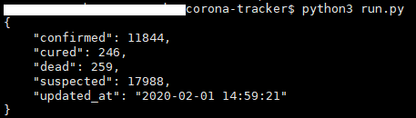
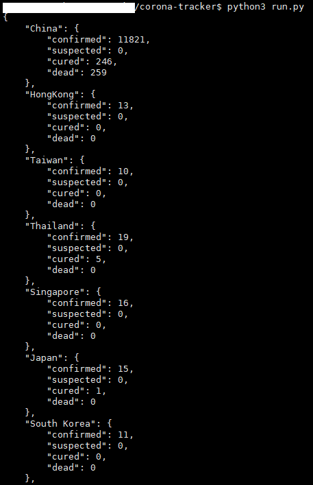

# Corona-Tracker
Convert Novel coronavirus(2019-nCoV) statistical data from the Chinese medical community(dxy.cn) to json format

# Requirements
```
python3
```

# Usage
1. Get infection statistics by country

    
    ```
    CoronaTracker.get_all_statistics()
    ```

2. Get infection statistics for all countries

    
    ```
    CoronaTracker.get_country_statistics()
    ```