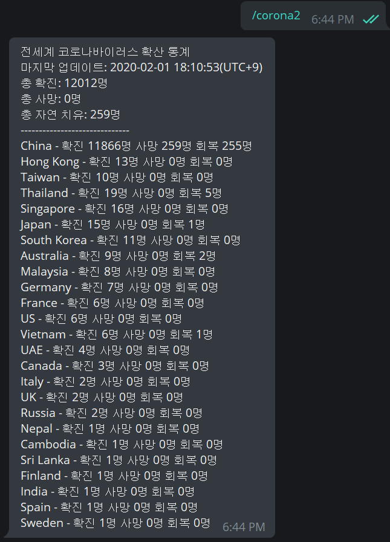

# Corona-Tracker
Convert Novel coronavirus(2019-nCoV) statistical data from the Chinese medical community(dxy.cn) to json format

# Requirements
need to ```python``` module below.
```
pip install requests
```

# Usage
1. Get infection statistics by country

    
    ```
    CoronaTracker.all_statistic
    ```

2. Get infection statistics for all countries

    
    ```
    CoronaTracker.country_statistic
    ```

# Service
## Telegram bot is now available!


- Command: /corona2
- Bot Link: [@nyong_bot](https://t.me/nyong_bot)`
